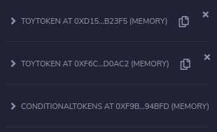

    <iframe class="resp-iframe" src="https://www.youtube-nocookie.com/embed/uZNWq07Y4Ag?start=705" frameborder="0" allow="accelerometer; autoplay; encrypted-media; gyroscope; picture-in-picture" allowfullscreen></iframe>

Having discussed outcome collections and how to derive their IDs, we can now finally get to the concept called positions and their respective IDs.

Positions can simply be defined as an outcome collection together with a collateral token.

Recall earlier that we have deployed two ERC20 tokens to be used as collateral.

The addresses for these tokens can be found earlier in the deployed contracts list in Remix.

Say you called your tokens `T1` and `T2`, a position that results in the payout of token `T1` under the condition that either B or C from the first condition occurs can be derived from the `T1` token address on the chain and the `(B|C)` collection ID, which you derived earlier.

Use the `getPositionID()` function with the `T1` token address and collection ID for `(B|C)` as parameters.

This position ID is also the ERC1155 ID that identifies the conditional token, or outcome token, that represents a stake in this position.

You can also find the position ID for a position that pays out in `T1` when only A occurs by using the same collateral token address but the collection ID for the outcome collection of only A.

We can also find the position ID for the outcome collection B or C except one that pays out in `T2` instead of `T1`.

*Note that this position ID differs from the other positions ID that pays out under the same circumstances except with a different collateral token.*

We can continue to derive position IDs in this way for the other outcome collections mentioned earlier.

Once we have these position IDs, we can finally start querying accounts for their respective stakes in positions or the amount of conditional tokens they may be holding. In order to do so, we may use ERC1155 method of `balanceOf()` or, if we are querying for multiple positions, `balanceOfBatch()`.

---

Now that we can derive position IDs, let's use them to split some collateral into sets of conditional tokens.
