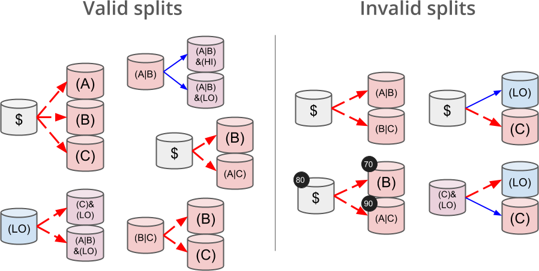
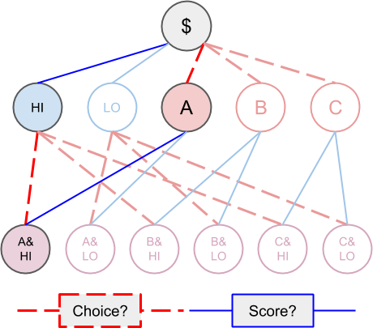

Once conditions have been prepared, stake in positions contingent on these conditions may be obtained. Furthermore, this stake must be backed by collateral held by the contract. In order to ensure this is the case, stake in shallow positions may only be minted by sending collateral to the contract for the contract to hold, and stake in deeper positions may only be created by burning stake in shallower positions. Any of these is referred to as *splitting a position*, and is done through the following
function:


<span style="color:#009cb4">*function* **splitPosition** *(IERC20 collateralToken, bytes32 parentCollectionId, bytes32 conditionId, uint[] calldata partition, uint amount) external*</span>

This function splits a position. If splitting from the collateral, this contract will attempt to transfer amount collateral from the message sender to itself. Otherwise, this contract will burn amount stake held by the message sender in the position being split worth of EIP 1155 tokens. Regardless, if successful, amount stake will be minted in the split target positions. If any of the transfers, mints, or burns fail, the transaction will revert. The transaction will also revert if the given partition is trivial, invalid, or refers to more slots than the condition is prepared with.

**Parameters:**	
- **collateralToken** – The address of the positions’ backing collateral token.
- **parentCollectionId** – The ID of the outcome collections common to the position being split and the split target positions. May be null, in which only the collateral is shared.
- **conditionId** – The ID of the condition to split on.
- **partition** – An array of disjoint index sets representing a nontrivial partition of the outcome slots of the given condition. E.g. A|B and C but not A|B and B|C (is not disjoint). Each element’s a number which, together with the condition, represents the outcome collection. E.g. 0b011 is A|B, 0b010 is B, etc.
-**amount** – The amount of collateral or stake to split.


If this transaction does not revert, the following event will be
emitted:

<span style="color:#009cb4">*event* **Positionsplit** *address indexed stakeholder, IERC20 collateralToken, bytes32 indexed parentCollectionId, bytes32 indexed conditionId, uint[] partition, uint amount)*</span>

Emitted when a position is successfully split.


To decipher this function, let's consider what would be considered a
valid split, and what would be invalid:




## Basic Splits

Collateral <span style="color:#DB3A3D">`$`</span> can be split into conditional tokens in positions
<span style="color:#DB3A3D">`$:(A)`</span>, <span style="color:#DB3A3D">`$:(B)`</span>, and <span style="color:#DB3A3D">`$:(C)`</span>. To do so, use the following code:

``` js
const amount = 1e18 // could be any amount

// user must allow conditionalTokens to
// spend amount of DollaCoin, e.g. through
// await dollaCoin.approve(conditionalTokens.address, amount)

await conditionalTokens.splitPosition(
    // This is just DollaCoin's address
    '0xD011ad011ad011AD011ad011Ad011Ad011Ad011A',
    // For splitting from collateral, pass bytes32(0)
    '0x0000000000000000000000000000000000000000000000000000000000000000',
    // "Choice" condition ID:
    // see A Categorical Example for derivation
    '0x67eb23e8932765c1d7a094838c928476df8c50d1d3898f278ef1fb2a62afab63',
    // Each element of this partition is an index set:
    // see Outcome Collections for explanation
    [0b001, 0b010, 0b100],
    // Amount of collateral token to submit for holding
    // in exchange for minting the same amount of
    // conditional token in each of the target positions
    amount,
)
```

The effect of this transaction is to transfer <span style="color:#DB3A3D">`amount`</span> DollaCoin from
the message sender to the <span style="color:#DB3A3D">`conditionalTokens`</span> to hold, and to mint
<span style="color:#DB3A3D">`amount`</span> of conditional token for the following positions:

  - <span style="color:#DB3A3D">`$:(A)`</span>
  - <span style="color:#DB3A3D">`$:(B)`</span>
  - <span style="color:#DB3A3D">`$:(C)`</span>


>**Note**
The previous example, where collateral was split into shallow positions
containing collections with one slot each, is similar to
<span style="color:#DB3A3D">`Event.buyAllOutcomes`</span> from Gnosis' first prediction market contracts.

The set of <span style="color:#DB3A3D">`(A)`</span>, <span style="color:#DB3A3D">`(B)`</span>, and <span style="color:#DB3A3D">`(C)`</span> is not the only nontrivial partition
of outcome slots for the example categorical condition. For example, the
set <span style="color:#DB3A3D">`(B)`</span> (with index set `0b010`</span>) and <span style="color:#DB3A3D">`(A|C)`</span> (with index set <span style="color:#DB3A3D">`0b101`</span>)
also partitions these outcome slots, and consequently, splitting from
<span style="color:#DB3A3D">`$`</span> to <span style="color:#DB3A3D">`$:(B)`</span> and <span style="color:#DB3A3D">`$:(A|C)`</span> is also valid and can be done with the
following code:

``` js
await conditionalTokens.splitPosition(
    '0xD011ad011ad011AD011ad011Ad011Ad011Ad011A',
    '0x0000000000000000000000000000000000000000000000000000000000000000',
    '0x67eb23e8932765c1d7a094838c928476df8c50d1d3898f278ef1fb2a62afab63',
    // This partition differs from the previous example
    [0b010, 0b101],
    amount,
)
```

This transaction also transfers <span style="color:#DB3A3D">`amount`</span> DollaCoin from the message
sender to the<span style="color:#DB3A3D"> `conditionalTokens`</span> to hold, but it mints <span style="color:#DB3A3D">`amount`</span> of
conditional token for the following positions instead:

  - <span style="color:#DB3A3D">`$:(B)`</span>
  - <span style="color:#DB3A3D">`$:(A|C)`</span>

<span style="color:#e8663d">**Warning:**</span>
<span style="color:#e8663d">If non-disjoint index sets are supplied to `splitPosition`, the transaction will revert. Partitions must be valid partitions. For example, you can’t split `$` to `$:(A|B)` and `$:(B|C)` because `(A|B)` `(0b011)` and `(B|C)` `(0b110)`share outcome slot `B (0b010)`.</span>


## Splits to Deeper Positions

It's also possible to split from a position, burning conditional tokens
in that position in order to acquire conditional tokens in deeper
positions. For example, you can split `$:(A|B)` to target `$:(A|B)&(LO)`
and `$:(A|B)&(HI)`:

``` js
await conditionalTokens.splitPosition(
    // Note that we're still supplying the same collateral token
    // even though we're going two levels deep.
    '0xD011ad011ad011AD011ad011Ad011Ad011Ad011A',
    // Here, instead of just supplying 32 zero bytes, we supply
    // the collection ID for (A|B).
    // This is NOT the position ID for $:(A|B)!
    '0x229b067e142fce0aea84afb935095c6ecbea8647b8a013e795cc0ced3210a3d5',
    // This is the condition ID for the example scalar condition
    '0x3bdb7de3d0860745c0cac9c1dcc8e0d9cb7d33e6a899c2c298343ccedf1d66cf',
    // This is the only partition that makes sense
    // for conditions with only two outcome slots
    [0b01, 0b10],
    amount,
)
```

This transaction burns <span style="color:#DB3A3D">`amount`</span>  of conditional token in position
<span style="color:#DB3A3D">`$:(A|B)`</span> (position ID
<span style="color:#DB3A3D">`0x5355fd8106a08b14aedf99935210b2c22a7f92abaf8bb00b60fcece1032436b7`</span>) in
order to mint <span style="color:#DB3A3D">`amount`</span> of conditional token in the following positions:

  - <span style="color:#DB3A3D">`$:(A|B)&(LO)`</span>
  - <span style="color:#DB3A3D">`$:(A|B)&(HI)`</span>

Because the collection ID for <span style="color:#DB3A3D">`(A|B)&(LO)`</span> is just the sum of the
collection IDs for <span style="color:#DB3A3D">`(A|B)` and <span style="color:#DB3A3D">`(LO)`</span>, we could have split from <span style="color:#DB3A3D">`(LO)`</span>
to get <span style="color:#DB3A3D">`(A|B)&(LO)`</span> and <span style="color:#DB3A3D">`(C)&(LO)`</span>:

``` js
await conditionalTokens.splitPosition(
    '0xD011ad011ad011AD011ad011Ad011Ad011Ad011A',
    // The collection ID for (LO).
    // This collection contains an outcome collection from the example scalar condition
    // instead of from the example categorical condition.
    '0x560ae373ed304932b6f424c8a243842092c117645533390a3c1c95ff481587c2',
    // This is the condition ID for the example categorical condition
    // as opposed to the example scalar condition.
    '0x67eb23e8932765c1d7a094838c928476df8c50d1d3898f278ef1fb2a62afab63',
    // This partitions { A, B, C } into [{ A, B }, { C }]
    [0b011, 0b100],
    amount,
)
```

The <span style="color:#DB3A3D">`$:(A|B)&(LO)`</span> position reached is the same both ways.



## Splits on Partial Partitions

Supplying a partition which does not cover the set of all outcome slots
for a condition, but instead some outcome collection, is also possible.
For example, it is possible to split <span style="color:#DB3A3D">`$:(B|C)`</span> (position ID
<span style="color:#DB3A3D">`0x5d06cd85e2ff915efab0e7881432b1c93b3e543c5538d952591197b3893f5ce3`) to
<span style="color:#DB3A3D">`$:(B)`</span> and <span style="color:#DB3A3D">`$:(C)`</span>:

``` js
await conditionalTokens.splitPosition(
    '0xD011ad011ad011AD011ad011Ad011Ad011Ad011A',
    // Note that we also supply zeroes here, as the only aspect shared
    // between $:(B|C), $:(B) and $:(C) is the collateral token
    '0x0000000000000000000000000000000000000000000000000000000000000000',
    '0x67eb23e8932765c1d7a094838c928476df8c50d1d3898f278ef1fb2a62afab63',
    // This partition does not cover the first outcome slot
    [0b010, 0b100],
    amount,
)
```
## Merging Positions

Merging positions does precisely the opposite of what splitting a
position does. It burns conditional tokens in the deeper positions to
either mint conditional tokens in a shallower position or send
collateral to the message sender:


To merge positions, use the following function:


<span style="color:#009cb4">*function* **mergePosition** *(IERC20 collateralToken, bytes32 parentCollectionId, bytes32 conditionId, uint[] calldata partition, uint amount) external*</span>

If successful, the function will emit this event:

<span style="color:#009cb4">*event* **PositionsMerge** *(IERC20 collateralToken, bytes32 parentCollectionId, bytes32 conditionId, uint[] calldata partition, uint amount) external*</span>

This generalizes <span style="color:#DB3A3D">`sellAllOutcomes`</span> from Gnosis’ first prediction market contracts like <span style="color:#DB3A3D">`splitPosition`</span> generalizes <span style="color:#DB3A3D">`buyAllOutcomes`</span>.
