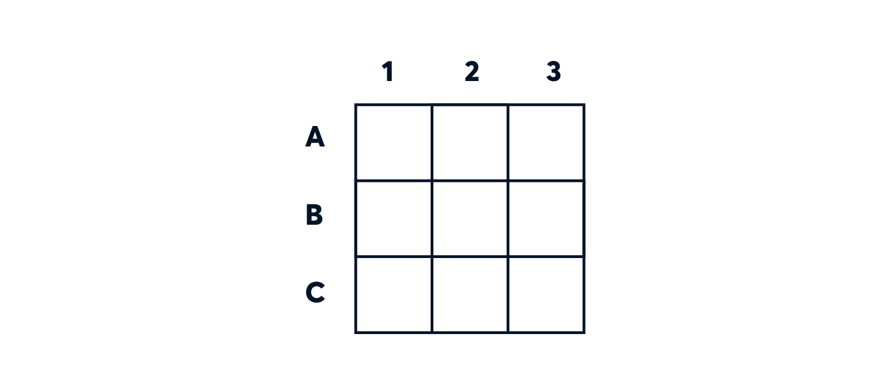
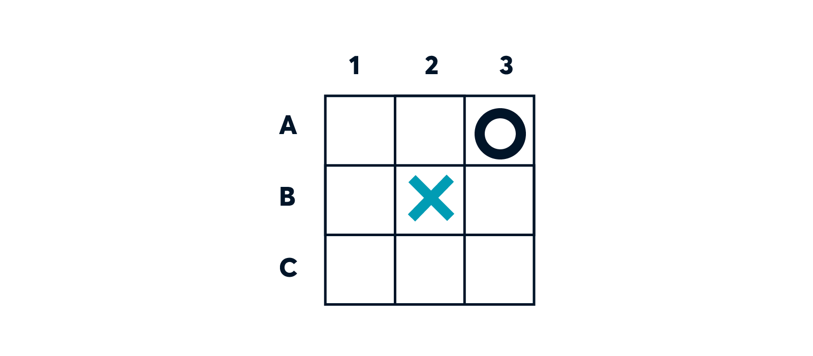
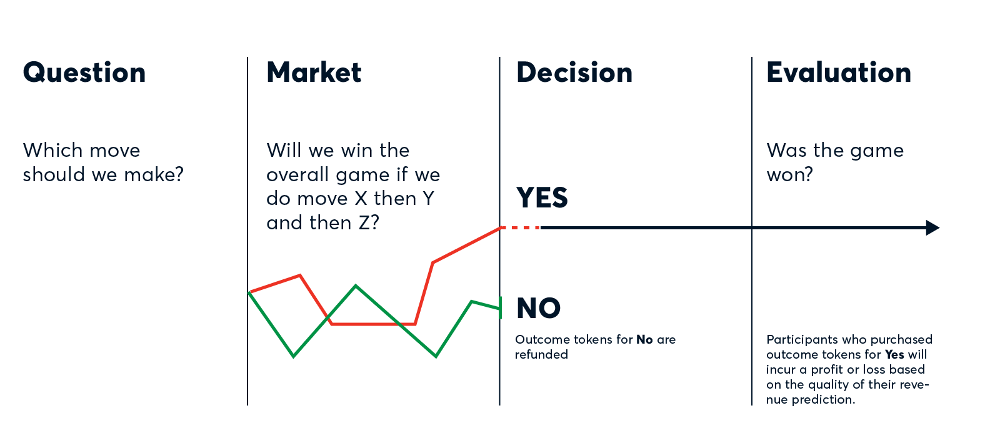

Futarchy is a major use case for the conditional tokens open framework. The nature of conditional tokens enable combinatorial outcomes which are essential for futarchy. You might be asking, however, what's futarchy, and what does it have to do with games in this post? Futarchy is a form of governance that uses prediction markets for decision-making. For example, you could create a prediction market on which political candidate, if elected, is most likely to support passing a universal healthcare bill by 2022. In this form of government, the market would decide who is elected, but profit would be determined based on whether a universal healthcare bill is passed by 2022. (You can read more about futarchy here.png)

Doesn't sound like a fun game to you yet? Imagine playing a popular game like Tic Tac Toe online. Yet, rather than playing as a single player, you play as a distributed team all contributing beliefs on the best next move, surfaced as market positions, to a Futarchy AI, which then performs an action in the game on your collective behalf. This crowd-sourced Futarchy AI would decide on which moves are the best ones to beat the opponent.

Let's walk through it together.

For each move, the Futarchy AI opens a market on which action to take next in the game. The main metric for evaluating the next move could be your ultimate performance in the game:

**Will you win against your opponent in this game of Tic Tac Toe, if a given action is taken?**
1. Yes
2. No

In Tic Tac Toe, a player has 9 different options for the first move. So, the vote for the first move would be stated as follows:

**What should be the first move to claim a square (X)?**

Everyone participating in the futarchy market would now decide the best move to win the overall game, by buying the correspondent outcome token in the market. Let's imagine the crowd decided to go for B2, i.e. the most hily valued outcome token was B2 at the specified market end time. The opponent player then chooses to claim square A3.

Once again, the Futarchy AI opens a market to decide on the next move.

**What square should the next move claim (X)?**

This will process continue until there is one winner or until there are no longer any possible moves.

The overall question of the futarchy market would be whether the Tic Tac Toe game will be won by the Futarchy AI. This market will be conditionally dependent on different markets deciding on the next move of the futarchy player. Lastly, the starting question on whether the game was won or not will be evaluated and resolved. Participants who purchased the correct tokens leading to the victory of the game will incur a profit on top of winning the match of Tic Tac Toe.

This game of a crowd-sourced Futarchy AI playing Tic Tac Toe is, of course, a very simple example. The Futarchy AI markets could be more dependent on strategy for advanced players. For example, one market series could ask: if the Futarchy AI moves to square B2, will the opponent move to C3? These market series would then encode and surface foresight in complex patterns of play. Such a market series could be more elaborate in Go, chess or other games, which have a greater combinatorial set of outcomes.

So why should we make such a simple game a bit more cumbersome? Putting futarchy to the test in gamified environments may be one way of rapid-prototyping how well futarchy works for gathering diverse opinions in limited timeframes, before moving on to more complex or hi stake challenges. Just imagine, one day our little Futarchy AI may be facing the then-old [AlphaGo](https://deepmind.com/research/case-studies/alphago-the-story-so-far).

*Let's see if we can beat it together!* 

**Want to build games or other dapps on the [conditional tokens open framework](https://github.com/gnosis/conditional-tokens-contracts)? Reach out to our grants program the [Gnosis Ecosystem Fund](https://github.com/gnosis/GECO) about supporting your project.**